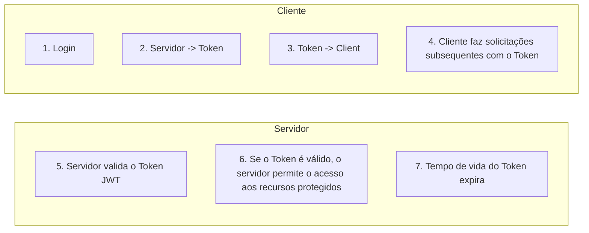

# Relação JWT - Client

#### Login :

Quando um usuário faz login com sucesso, o servidor gera um token JWT e o envia de volta para o cliente como parte da resposta. O token pode ser enviado no corpo da resposta ou como um cabeçalho.

#### Armazenamento do Token

O cliente (por exemplo, um navegador da web) recebe o token e o armazena de forma seguira. Isso pode ser feito no `localStorage`, em cookies seguros, ou em outros métodos de armazenamento seguro.]

#### Solicitações subsequentes

Quando o usuário faz solicitações subsequentes, o *cliente inclui o token JWT em cada solicitação*, geralmente no cabeçalho de autorização. O servidor verifica o token em cada solicitação para garantir que o usuário esteja autenticado.

#### Validação do Token

No servidor, o token JWT é validado. Isso envolve a verificação da assinatura do token para garantir que ele não foi adulterado, a verificação da data de validade do token e a validação das informações do usuário contidas no token. 

#### Acesso a recursos protegidos

Se o token for válido, o servidor permite ao usuário acessar os recursos protegidos ou executa as ações solicitadas. Caso contrário, o acesso é negado.

#### Tempo de vida do token

O token JWT geralmente tem um tempo de vida limitado (defiinido pelo servidor). Quando o token expira. O cliente deve obter um novo token por meio de um processo de renovação ou autenticação.

O cliente permanece autentiado enquantido tiver um token JWT válido e armazenado de forma segura. Quando o token expira, o usuário precisará fazer login novamente para obter um novo token.

Em resumo, o JWT é usado para manter o usuário autenticado entre as solicitações, e seu armazenamento no cliente é essencial para a autenticação persistente. No entanto, a segurança do token e a gestão adequada do tempo de vida do token são fundamentais para garantir a autenticação segura. 

